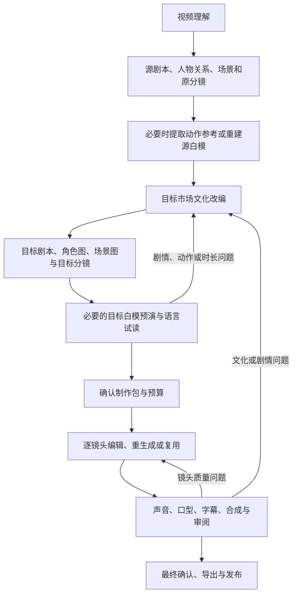

# 新链路：从已有短剧到目标市场版本

方案版本：v0.3，更新于2026-09-17。**这是产品与开发方案；当前可运行版本仍为0.2.0工程预览，运行契约为0.2.1。** 自动视频理解、逆向白模、角色/场景图生成及真实本地化成片尚未实现或验证。

## 完整链路

**视频理解 → 源资产提取与重建（剧本、人物关系、角色与场景参考、原分镜、必要的白模视频）→ 目标市场文化改编（新剧本、角色图、场景图、目标分镜与白模预演）→ 改编方案与预算确认 → 逐镜头视频制作 → 合成、审阅与局部修复 → 最终确认与发布。**

首个目标为美国、美式英语。市场选择需要进一步描述受众、类型、年代、生活背景与改编程度，不能只用国家名称决定人物外观或文化表达。

白模是按需分支，简单镜头可跳过并记录原因；跳过不等于已验证。任何前置分析、参考图或预演若涉及收费或素材外传，都需要在该次调用前有对应的素材范围和额度。前置确认绑定该阶段输入/计划hash，只覆盖该阶段；图中的制作包确认另绑定完整制作包hash，用于锁定正式制作版本，不把之前的收费操作默认为免费。当前工程模式不执行这些外部调用。

## 每一步的输入、输出与检查

| 阶段 | 输入 | 输出 | 确认与验收重点 |
|---|---|---|---|
| 1. 视频理解 | 本地视频、可选剧本/SRT/角色图/分轨 | 镜头时间段、对白、人物与动作观察、文化线索、未知项 | 每项观察能定位源文件与时间段；优先复用现有资产 |
| 2. 源资产提取与重建 | 视频观察与创作者补充 | 源剧本、人物关系、场景/道具表、源分镜、可选动作参考或源白模 | 区分直接观察、推断、近似重建；来源不明不补成事实 |
| 3. 目标市场文化改编 | 源资产包、目标brief与剧情约束 | 目标剧本、角色/场景图、目标分镜、可选目标白模与试读 | 每项改动写明理由和影响；源与目标资产分开，支持拆镜、合镜及新增镜头 |
| 4. 改编方案与预算确认 | 目标资产、依赖、路线和估价 | 确认的制作包版本、允许执行的范围、费用上限与修复额度 | 确认绑定具体内容；模型自行填写approved不赋予执行权限 |
| 5. 逐镜头视频制作 | 已确认制作包与供应商能力 | 原片编辑、重新生成或复用的镜头；声音与任务记录 | 以目标镜头为单位；原生音频驱动先准备认可的目标音轨 |
| 6. 合成、审阅与局部修复 | 镜头、声音、字幕与质量问题 | 成片、质量报告、问题定位、新版本及重做范围 | 最终媒体时长决定时间线；技术、视觉、语言、文化分别审阅 |
| 7. 最终确认与发布 | 当前成片、审阅结论与适用素材范围 | 导出包或指定平台发布记录 | 确认绑定成片hash；修改后不得沿用旧发布确认 |

Agent负责分析、提案、调用工具、检查和追踪；创作者确认故事约束、制作范围/费用与最终发布。开发团队的多agent分工，不等于产品已经运行多DSH子agent。

## 源资产和目标资产为什么分开

原片是一段成年角色被家族排斥的场景。源资料记录“宗祠门口被阻拦”及其时间位置；目标版本可以提出“家族晚宴被拒绝入席”，并记录要保留的排斥、羞辱和反抗动机。

目标版可能增加餐桌反应镜头、合并两句对白，或把原来的一个长镜头拆成两个近景。因此目标分镜需要独立ID，并通过映射保留源镜头与剧情依据。新镜头可没有直接对应的源画面，但必须记录新增理由和故事依据，不能伪造源时间戳。

第一次确认是核对源资料与希望保留的剧情；第二次确认是批准目标制作包。原片事实和目标创作决定分别保存，不能通过覆盖源剧本来完成改编。

## 白模的两个位置

- **源白模／动作参考**：估计原片的动作、构图、相机与空间关系，便于分析和复用。需要保留原片对照及不确定项；近似重建不等于原始三维工程。
- **目标白模预演**：根据目标剧本与分镜，检查新动作、人物站位、道具关系和目标语言时长。文化动作改变时，相应动作参考需要修改或重新制作。

首个开发版本采用本地二维占位人物、简化场景、时间轴与字幕/试读时长输入，不要求自动重建三维场景。必须标为人工输入、fixture或近似预演；目前已发布的色块测试片不属于逆向白模成果。

简单对白镜头可以直接使用原视频与目标分镜参考；有明显走位、交互或文化动作变化的镜头优先使用预演。是否把白模作为最终生成模型的控制输入，需要单独验证该模型的接口与实际约束效果。

## 修改如何传播

| 改动 | 需要重新检查或生成的内容 |
|---|---|
| 源对白识别或人物绑定纠正 | 相关剧情判断、改编映射、目标对白与下游产物 |
| 目标角色参考或服装版本变化 | 引用该版本的目标镜头及相关预演/口型/合成 |
| 场景、道具或文化动作变化 | 相关目标分镜、白模、视频与动作音效 |
| 目标对白或声音时长变化 | 声音、字幕、口型、预演时间线；音频驱动视频还需重做对应视频 |
| 拆镜、合镜或新增镜头 | 源目标映射、镜头顺序、生成任务、最终时间线与覆盖校验 |
| 某个候选画面不合格 | 保留历史，按原批准范围修复该镜头；扩大范围时重新确认 |
| 成片发生变化 | 重新聚合审阅，旧发布确认失效 |

不相关资产只有在具体依赖仍有效时才能复用，不能仅因为全局方案版本变化就全部重做，也不能自动给旧产物换上新版本号。

## 当前能力与新增工作

可复用：严格契约、结构化改编样例、SQLite任务记录、模拟预算、未知提交保护、mock provider、本地FFmpeg工具、审阅报告及DSH插件。

新增的[实验契约](WORKFLOW_DRAFT.md)已验证源证据记录、独立目标分镜、场景/道具、2D预演计划与制作包元数据。待开发：实际文件辅助导入、目标计划接入任务、白模渲染、可信制作确认、阶段编排、发布确认和完整验收。详见[架构增量](ARCHITECTURE.md)与[任务路线图](ROADMAP.md)。
